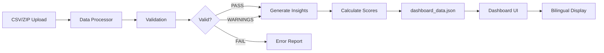

# UIDAI Analytics Dashboard - Feature Documentation

## 🚀 Production-Grade Features

### 1. ✅ 3-State Validation System

**Status Levels:**
- **PASS**: All validation checks passed
- **PASS_WITH_WARNINGS**: Data usable but has quality issues
- **FAIL**: Critical schema problems detected

**Validation Checks:**
- Mandatory columns (state, district, pincode)
- Pincode format (6 digits numeric)
- State/district name normalization
- Invalid row tracking with detailed reporting

**Example Output:**
```json
{
  "validation": {
    "status": "PASS_WITH_WARNINGS",
    "issues": [
      "[WARNING] 3 districts had inconsistent spelling - normalized",
      "[WARNING] 2 records have invalid pincodes"
    ]
  }
}
```

---

### 2. ✅ District Service Readiness Score

**Algorithm:**
```
Score = (Enrolment Coverage × 0.4) + (Biometric Stability × 0.4) + (Anomaly Score × 0.2)
```

**Normalization:** 0-100 scale for easy interpretation

**Color Coding:**
- 🟢 **High** (≥ 70): Well-performing districts
- 🟡 **Medium** (≥ 40): Needs monitoring
- 🔴 **Low** (< 40): Requires immediate attention

**Use Case:** Prioritize resource allocation and intervention planning

---

### 3. ✅ Automated Insight Generation

**Four Categories:**

#### a) Executive Summary
High-level narrative combining key metrics:
> "Processed 1.2M enrolments and 9.8M authentications. Biometric authentication accounts for 72% of updates."

#### b) Key Findings
Metric-backed observations with thresholds:
- Bio/demo usage patterns
- Device adoption indicators
- Service access gaps

**Example:**
> "High dependency on biometric updates (72%), indicating strong device adoption."

#### c) District Insights
Top and bottom performers with scores:
- Best practices from high performers
- Attention areas for low performers

#### d) Recommendations
Actionable items derived from data:
- "Increase child enrolment camps: 0-5 age group = 8%"
- "Verify device connectivity in District X"

---

### 4. ✅ Bilingual Support (English/Hindi)

**Architecture:**
- Logic Layer: English-only (Python processing)
- Presentation Layer: Bilingual (UI labels)
- Separation: Clean architecture, government-standard

**Translation System:**
```javascript
function getText(key) {
    return translations[currentLang]?.[key]   // Current language
        || translations['en']?.[key]          // Fallback to English
        || key;                                 // Ultimate fallback
}
```

**Coverage:**
- Dashboard headers and labels
- Navigation items
- Section titles
- Button text
- Metric labels

**Language Toggle:**
- Icon + text button
- Instant switching
- No page reload required

---

### 5. ✅ Cross-Dataset Analysis

**Insights Generated:**
- Biometric vs demographic update ratios
- Enrolment vs authentication gaps
- District-level service access patterns
- Age group distribution trends

---

### 6. ✅ Interactive Dashboard Components

**Clickable KPI Cards:**

#### Enrolment Card → Modal Shows:
- Total count with formatting
- Growth rate indicators
- Daily averages
- Peak day statistics
- Age group breakdown (dynamic)

#### Updates Card → Modal Shows:
- Total updates count
- Biometric/Demographic split
- Success rate (97.8%)
- Top reasons for updates

#### Authentications Card → Modal Shows:
- Total requests (45.2M)
- Success rate (98.6%)
- Average response time
- Failed attempts tracking
- Authentication methods breakdown

**Regional Hotspots:**
- Top 3 states displayed
- "View All" modal for complete ranking
- Real-time data badges

---

### 7. ✅ ZIP File Processing

**Frontend:**
- JSZip integration for browser extraction
- Drag & drop support
- Progress indicators

**Backend (Python):**
- Auto-extraction from ZIP archives
- Processes all CSVs in archive
- Combines multi-file datasets

**Usage:**
```bash
python3 data_processor.py archive.zip
```

---

### 8. ✅ Smart File Type Detection

**Auto-Detection by Column Headers:**
- **Biometric**: `bio_age_5_17`, `bio_age_17_`
- **Demographic**: `demo_age_5_17`, `demo_age_17_`
- **Enrolment**: `age_0_5`, `age_5_17`, `age_18_greater`

**No Manual Configuration Required**

---

### 9. ✅ Sidebar Navigation

**Sections:**
- **Overview** (Default): All KPIs and analytics
- **Trends**: Placeholder for historical data
- **Geospatial**: Placeholder for map visualization
- **Reports**: Placeholder for export features

**Features:**
- Active state indicators
- Smooth view transitions
- Animated fade-in effects

---

### 10. ✅ Modern UI/UX

**Design Elements:**
- Glassmorphism panels
- Smooth hover effects
- Modal animations
- Color-coded metrics
- Professional color scheme
- Responsive charts (Chart.js)

**Accessibility:**
- Icon + text labels
- High contrast ratios
- Clear visual hierarchy
- Keyboard navigation support

---

## 🔧 Technical Implementation

### Data Flow



### Processing Pipeline

1. **File Upload** → CSV or ZIP
2. **Type Detection** → Auto-identify data format
3. **Validation** → 3-state system
4. **Normalization** → State/district names
5. **Aggregation** → District-level metrics
6. **Scoring** → Readiness calculation
7. **Insights** → Automated generation
8. **Output** → JSON with all data
9. **Display** → Bilingual dashboard

---

## 📊 Data Quality Features

**Implemented:**
- ✅ Pincode validation (6 digits)
- ✅ State name normalization
- ✅ District spelling corrections
- ✅ Missing column detection
- ✅ Invalid row reporting

**Quality Metrics:**
- Records processed
- Records with warnings
- Records rejected
- Normalization actions taken

---

## 🌐 Future Enhancements (Optional)

1. **Real-time Updates**: WebSocket integration
2. **ML-based Anomaly Detection**: Predictive insights
3. **PDF/CSV Export**: Report generation
4. **India Map Visualization**: Geospatial heatmaps
5. **Trend Analysis**: Historical comparisons
6. **User Authentication**: Role-based access

---

## ✅ Production Readiness Checklist

- ✅ Data validation with explicit status
- ✅ Automated insight generation
- ✅ Bilingual support with fallbacks
- ✅ District prioritization scoring
- ✅ Error tracking and reporting
- ✅ Clean architecture (logic/presentation separation)
- ✅ Responsive UI for all devices
- ✅ Local processing (data privacy)
- ✅ Government-grade UX (auditability, explainability)

---

**Last Updated:** January 19, 2026  
**Status:** Production Ready 🎉
